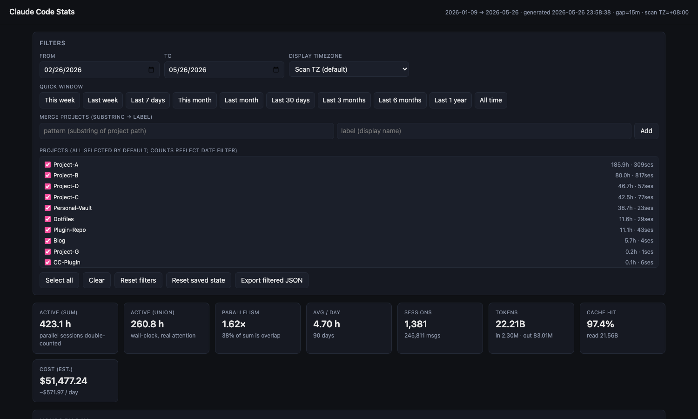
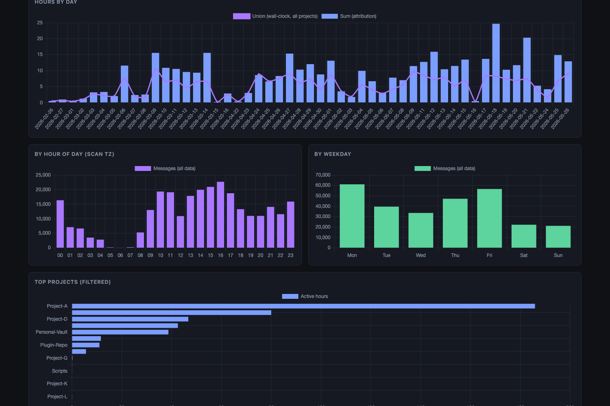
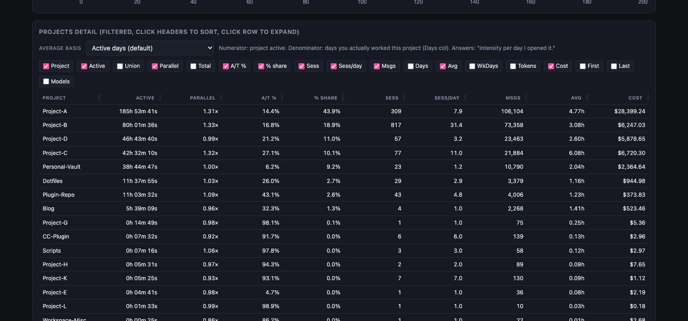
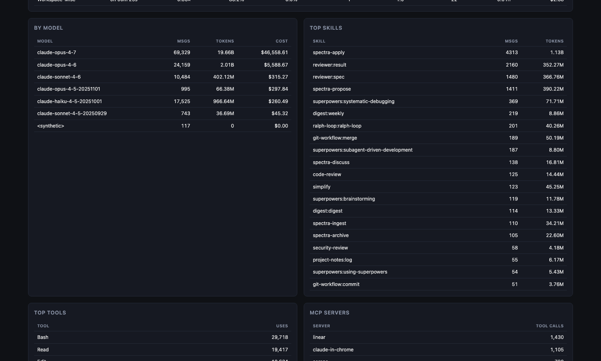
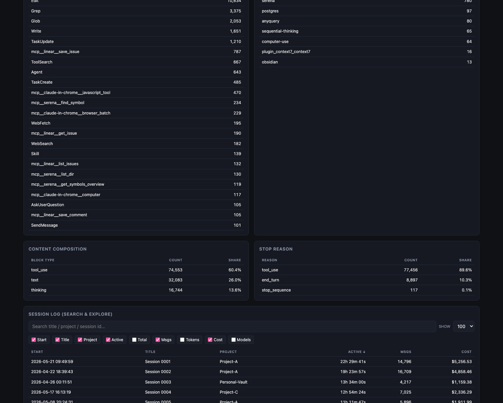

# cc-stats

[](https://github.com/shdennlin/claude-code-stats/actions/workflows/ci.yml)
[](LICENSE)
[](https://shdennlin.github.io/claude-code-stats/)

Claude Code usage analytics — token / cost / active-time / skill-attribution / tool-use stats parsed from `~/.claude/projects/**/*.jsonl`.

Self-contained interactive HTML report. No server. Drop-in CLI: `cc-stats`.

## ⚡ Run it on YOUR own data (60 seconds, recommended)

The whole point is to see **your** numbers — the live demo below is just a preview. Recommended path:

```bash
# 1. Install (one of)
cargo install --git https://github.com/shdennlin/claude-code-stats     # if you have Rust
# OR download from https://github.com/shdennlin/claude-code-stats/releases

# 2. Run and open the report in your browser
cc-stats --open
```

That generates a single `out/report.html` from `~/.claude/projects/*.jsonl` and opens it. **The HTML is self-contained** (data embedded) — save it, share it, email it, no server needed.

> 💡 The HTML viewer is much richer than any static screenshot can convey: live filters, click-to-drill-down, sortable columns, persistent localStorage state, project merge rules, TZ toggle, average basis dropdown, search. Open it locally and explore.

## 🌐 Live demo (preview without installing)

If you want to peek before installing: **[shdennlin.github.io/claude-code-stats](https://shdennlin.github.io/claude-code-stats/)** — anonymized dataset from my own usage. Same UI, same interactivity, just not your data.



<details>
<summary><b>More static views</b> — charts, projects detail, tools breakdown, session log (click to expand)</summary>

> Reminder: these are just snapshots. The **[live demo](https://shdennlin.github.io/claude-code-stats/)** is interactive (sorting / filtering / drilldown / TZ toggle / merge rules) and shows everything below in one place.

### Hours-by-day chart (sum vs union) · by hour-of-day · by weekday · top projects bar


### Projects detail table (sortable, expandable rows, column toggle, Average basis dropdown)


### By model · top skills · top tools · MCP servers · content composition · stop reason


### Session log (search & explore) — title / project / cost-sortable, full-text filter


</details>

## Install (detailed options)

```bash
# Option A: cargo install (needs Rust)
cargo install --git https://github.com/shdennlin/claude-code-stats

# Option B: build from source
git clone https://github.com/shdennlin/claude-code-stats
cd claude-code-stats
cargo build --release
ln -sf "$(pwd)/target/release/cc-stats" ~/.local/bin/cc-stats

# Option C: pre-built binary
# Grab from https://github.com/shdennlin/claude-code-stats/releases
# (macOS arm64/x86_64, Linux x86_64/aarch64 — built by CI on tag push)
```

## Usage

```bash
cc-stats                                  # last 365 days, output to ./out/
cc-stats --all                            # full history
cc-stats --days 90                        # last 90 days
cc-stats --from 2026-05-01 --to 2026-05-26
cc-stats --project myproject -p frontend  # filter (repeatable substring match)
cc-stats --merge "myproject=Project-A"    # merge matching projects under one label
cc-stats --gap 30                         # active-time gap threshold (minutes; default 15)
cc-stats --tz "+08:00"                    # force timezone for buckets (default: system local)
cc-stats --format html                    # html only (default: all = json+csv+html)
cc-stats --open                           # open report.html after generating
cc-stats --default-window-days 30         # HTML viewer's initial date window
```

### `--merge` (anonymize / group folders into one project)

`--merge "PATTERN=LABEL"` (repeatable, case-insensitive) collapses any project whose path contains `PATTERN` into a single project named `LABEL`. Without `=LABEL`, the pattern itself is used as the label.

The HTML viewer also supports merge rules interactively (no rerun needed) — useful for anonymizing screenshots or grouping sub-paths on the fly.

## Output (`./out/`)

| File | Contents |
|---|---|
| `data.json` | Full structured report — `summary`, `projects`, `sessions`, `daily`, `by_model`, `by_skill`, `by_plugin`, `by_tool`, `by_mcp_server`, `by_content_type`, `by_stop_reason`, `by_branch`, `by_hour`, `by_weekday`. |
| `daily.csv` / `projects.csv` / `sessions.csv` | Flat CSVs for spreadsheet drilling. |
| `report.html` | Self-contained interactive viewer (data embedded). Open in any browser. Filters, charts, sortable tables, drilldown, localStorage-persisted state. |

## What's measured

| Concept | How |
|---|---|
| **Active time (sum)** | Sum of gaps ≤ `--gap` minutes (default 15) between consecutive messages, per session. Parallel sessions double-counted. |
| **Active time (union)** | Wall-clock union of all sessions' gaps per day (parallel sessions deduped). The truer "you were really in front of the laptop" number. |
| **Parallelism** | `sum / union`. 1.0× = sequential; higher = you ran multiple Claude Code sessions in parallel. |
| **Total wall-clock** | First → last message per session, summed. Includes idle (sessions left open). |
| **Tokens** | input / output / cache_create (5m+1h) / cache_read, summed from `usage` in assistant messages. |
| **Cost (estimate)** | Pay-as-you-go API rates per model. Max-plan subscribers don't actually pay this — it's an equivalent-cost reference. |
| **Cache hit rate** | `cache_read / (cache_read + cache_create + input)`. |
| **Skills / plugins** | From `attributionSkill` / `attributionPlugin`. |
| **Tools** | Walks `assistant.content[].tool_use.name`. MCP tools also grouped by server (`mcp__<server>__*`). |
| **Content composition** | thinking / text / tool_use block ratio. |
| **Stop reason** | `end_turn` / `tool_use` / `stop_sequence` distribution. |
| **Git branch** | Per-branch active / messages / cost. |
| **Session titles** | From `ai-title` / `custom-title` events (custom overrides AI-generated). |

### Pricing table (USD per million tokens)

| Model  | input | output | cache_write_5m | cache_write_1h | cache_read |
|---|---|---|---|---|---|
| Opus   | 15 | 75 | 18.75 | 30 | 1.50 |
| Sonnet | 3  | 15 | 3.75  | 6  | 0.30 |
| Haiku  | 1  | 5  | 1.25  | 2  | 0.10 |

## Performance

Scanning all ~2k sessions / 280k messages on M-series MacBook: ~4s.

## Layout

```
.
├── Cargo.toml / Cargo.lock
├── src/main.rs                # parser + aggregation + CLI
├── templates/report.html      # embedded into binary via include_str!
├── scripts/regen-demo.sh.example  # maintainer-only: regenerate docs/index.html
├── .github/workflows/
│   ├── ci.yml                 # fmt + clippy + build + test on push/PR
│   └── release.yml            # tag → cross-platform binaries on Releases
├── docs/
│   ├── index.html             # live demo (anonymized, committed)
│   ├── .nojekyll              # tells GH Pages: skip Jekyll
│   └── screenshots/           # hero shot for README
└── out/                       # gitignored; regenerated each `cc-stats` run
```

## License

MIT — see [LICENSE](LICENSE).
